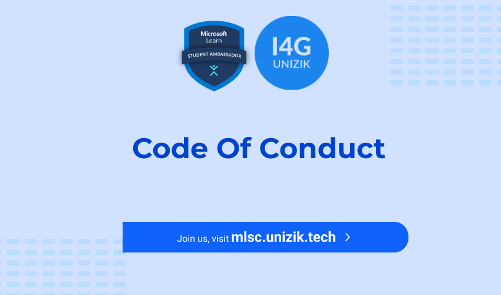

<h1 align="center"> Community Code of Conduct. </h1>

  

<h1 align="center"> Code of Conduct </h1>
  -  Be friendly and patient.  
  -  Be welcoming. We strive to be a community that welcomes and supports people of all backgrounds and identities. This includes members of any race, ethnicity, culture, national origin, color, immigration status, social and economic class, educational level, sex, sexual orientation, gender identity and expression, age, size, family status, political belief, religion, and mental and physical ability.  
  -  Be empathetic. Give and gracefully accept constructive feedback. Accept responsibility and apologize to those affected by your mistakes.  
  -  Be respectful. People working together will inevitably disagree or become frustrated with one another at times, but conflict is no excuse for bad behavior or personal attacks. A community where people feel uncomfortable or threatened is not a productive one. Be respectful of one another and those outside our community who interact with us.  
  -  Be careful in the words that you choose. Conduct yourself professionally. Be kind to others. Refrain from all forms of harassment, including:  
        * Violent threats or language directed against another person. 
        * Discriminatory jokes and language.  
        * Posting sexually explicit or violent material.  
        * Posting (or threatening to post) other people's personally identifying information ("doxing").  
        * Personal insults, especially those using racist or sexist terms.  
        * Unwelcome sexual attention.  
        * Advocating for, or encouraging, any of the above behavior.  
        * Repeated harassment of others. In general, if someone asks you to stop, then stop.  
  -  Be understanding. Strive to resolve disagreements constructively. Our contributions come from different backgrounds and have different perspectives. If you disagree with someone, seek to understand their perspective and share yours respectfully.  
  -  Examples of unacceptable behavior by the Community include:  
    + The use of sexualized language or imagery, and sexual attention or advances of any kind.  
    + Trolling, insulting or derogatory comments, and personal or political attacks  
    + Public or private harassment  
    + Defrauding or making attempt(s) to defraud a member.  
    + Publishing others' private information, such as a physical or email address, without their explicit permission.  
    + Other conduct which could reasonably be considered inappropriate in a professional setting.  

<h1 align="center">Our Responsibilities</h1>
Community leaders are responsible for clarifying and enforcing our standards of acceptable behavior and will take appropriate and fair corrective action in response to any behavior that they deem inappropriate, threatening, offensive, or harmful.
Community leaders have the right and responsibility to remove, edit, or reject comments, commits, code, wiki edits, issues, and other contributions that are not aligned to this Code of Conduct, and will communicate reasons for moderation decisions when appropriate.

<h1 align="center"> Scope </h1>
This Code of Conduct applies within all community spaces, and also applies when an individual is officially representing the community in public spaces. Examples of representing our community include using an official e-mail address, posting via an official social media account, or acting as an appointed representative at an online or offline event.

<h1 align="center"> Enforcement </h1>
Instances of abusive, harassing, or otherwise unacceptable behavior may be reported to the community leaders responsible for enforcement at mlsc@unizik.tech. All complaints will be reviewed and investigated promptly and fairly.
All community leaders are obligated to respect the privacy and security of the reporter of any incident.

<h1 align="center" >Help and Feedback </h1>
If for any reason, you feel unsafe, unwelcome or uncomfortable as a result of an interaction within the community, immediately reach out to;  
+ Nehemiah via emmanueln644@gmail.com or call 08163128234  
+ Nelson via ekwuememichael131@gmail.com.

# Attribution 
This Code of Conduct is adapted from [here](https://github.com/nworiekingslee/GitHub-NAU/blob/main/CODE%20OF%20CONDUCT.md)
